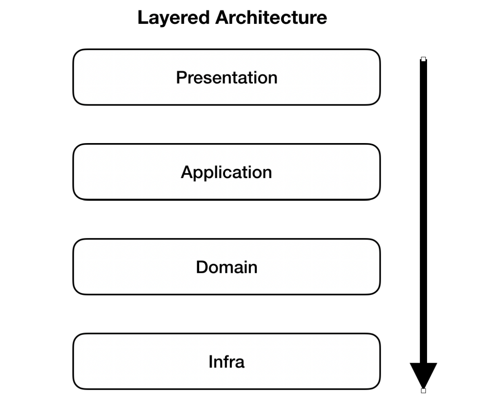

# e-커머스 상품 주문 서비스

## 기술 스택

- Java 17
- Sprig Boot 3.2.0
- Spring Web
- Spring Data JPA
- MySQL
- H2 Database
- QueryDsl
- Docker
- Github Actions
- AWS ECR (Elastic Container Registry)
- AWS ECS (Elastic Container Service)
- Mockito
- Thymeleaf


## 요구 사항

- 상품 주문에 필요한 메뉴 정보 들을 구성 하고 조회가 가능 해야 한다.
- 잔액 충전 , 상품 주문 시 회원의 포인트 사용 내역을 저장 한다.
- 사용자는 상품을 여러 개 선택 해서 주문할 수 있고, 미리 충전한 잔액을 이용한다.
- 상품 주문 내역을 통해 판매 량이 가장 높은 상품을 추천한다.
- 각 기능 및 제약 사항에 대한 단위 테스트를 반드시 하나 이상 작성 해야 한다.
- 동시성 이슈를 고려 하여 구현 한다.
- 재고 관리에 문제가 없도록 구현 한다.

## 패키지 구조

```
src
├──main
  ├──java
     ├──com
       ├──example
          ├──hanghaeplus
            ├─ application
            ├──common
            ├──domain
            ├──infrastructure
            ├──presentation
```

엔티티 안에서 비즈니스 로직을 가지고 객체지향을 활용하는 Domain Model Pattern 을 적용한다.


- common
    - 애플리케이션 전반적으로 공통적으로 사용되는 설정 파일, 예외 처리 및 응답과 관련된 클래스 등을 포함 한다.
- application
    - 비즈니스 로직을 정의하고 정상적으로 수행될 수 있도록 도메인 계층과 인프라스트럭쳐 계층을 연결해준다.
- presentation
    - 애플리케이션의 사용자 인터페이스 및 클라이언트와의 상호작용을 처리한다.
    - 요청을 받아 도메인 영역으로 전달하고, 도메인 모델의 변화를 사용자에게 응답으로 반환한다.
- domain
    - 애플리케이션의 핵심 비즈니스 로직을 담당한다.
    - 비즈니스 규칙을 구현하고, 도메인 객체 간의 관계를 관리하며, 영속화된 데이터를 조작하는 역할을 수행한다.
- infrastructure
    - 데이터베이스나 외부 시스템과의 상호작용을 담당하는 영역이다.





### 레이어드 아키텍처 (Layered Architecture)

- 레이어는 위에서 아래로 순방향으로만 참조 되어야 한다.
- 레이어의 참조 방향이 역류 되지 않아야 한다.
- presentation 에 응답 결과는 엔티티가 아니라 DTO를 반환해야 한다. 
  - 엔티티에는 패스워드와 같은 민감한 데이터가 포함될 수 있다.
  - 엔티티를 반환하면 양방향 무한 참조 문제가 발생할 수 있다.
  - 엔티티와 DTO 는 역할이 분리되어 있기 때문에 변경 사항이 있을 때 해당 영역만 수정 하면 된다.
  - 엔티티가 변경 되면 API 스펙이 전부 변경 된다.


## API 스펙 

### 회원 API

- 회원 등록
  - 이름 ,닉네임 ,이메일 , 비밀번호 정보를 통해 회원을 등록한다.
  - 비밀번호는 암호화 한다.
  - 회원 등록 시 포인트는 0으로 초기화 한다.
  - 닉네임과 이메일은 다른 회원과 중복 되어서는 안된다.

- 회원 목록
  - 등록 된 회원 목록을 조회 한다.

- 포인트 충전
  - 상품 주문에 필요한 포인트를 충전 한다.
- 포인트 조회
  - 회원의 포인트를 조회한다.

### 상품 API

- 상품 등록
  - 상품 이름, 가격, 재고 수량 정보를 통해 상품을 등록 한다.
- 상품 조회
  - 상품 식별자 를 통해 상품 정보(ID , 이름, 가격 ,잔여 수량) 를 조회 한다.
-  재고 추가  
  - 상품의 재고 수량을 추가 한다.
- 카테고리 등록
  - 카테고리 이름 데이터로 카테고리를 등록 한다.
- 카테고리 목록 조회
  - 카테고리 목록을 조회 한다.

### 주문 API

- 상품 주문
  - 사용자 식별자 ,상품 Id ,상품 수량을 통해 주문을 요청한다. 
  - 주문 한 상품 수량 만큼 재고를 차감 한다.
  - 만약 해당 상품의 재고가 부족 하면 주문을 취소 한다.
  - 주문 한 상품 가격 만큼 회원의 포인트를 차감한다.
  - 회원의 포인트가 부족하면 주문은 취소 된다. 
- 주문 조회
  - 주문 ID , 유저 ID , 유저 이름, 주문 가격, 할인 가격 정보를 조회 한다.
- 상위 상품 조회
  - 주문 내역 정보를 통해 최근 3일 간 가장 인기가 많은 상품 top3 를 조회 한다.
  - 쿼리 비용을 줄이기 위해 캐시를 적용 한다. 

### 쿠폰 API

- 쿠폰 등록
  - 할인율, 만료 기간 정보를 통해 쿠폰을 등록한다.
  - 코드는 UUID 로 생성한다.
- 쿠폰 조회
  - 할인 쿠폰 코드 이름으로 해당 쿠폰을 조회한다.

### 포인트 API

- 포인트 내역 조회
  - 회원들의 포인트 사용 내역 (충전, 차감) 을 조회 한다.


## 테스트

- 테스트의 격리성을 위해 로컬 환경과 테스트 환경을 분리 한다.
- 테스트는 독립적으로 수행 되어야 한다.
  - 테스트 실행 순서에 상관 없이 항상 성공 해야 한다.
- 테스트는 코드를 수정 한 후에도 의도한 대로 작동 해야 한다.

### 테스트 코드를 작성 해야 하는 이유

- 개발 과정에서 문제를 미리 발견할 수 있다.
- 기능 추가와 리팩토링을 안심하고 할 수 있다.
- 빠른 시간 내에 코드의 동작 방식과 결과를 확인할 수 있다.
- 좋은 테스트 코드를 작성하려 하다보면, 자연스럽게 좋은 코드가 만들어진다.
- 잘 작성한 테스트는 문서 역할을 한다. 

### 패키지 구조

```
src
├──main
  ├──java
     ├──com
       ├──example
          ├──hanghaeplus
            ├─ application
            ├──common
              ├── builder
              ├── fixture
            ├──domain
            ├──infrastructure
            ├──medium
            ├──presentation
```

- common
  - builder : 테스드 데이터를 생성 한다.
  - fixture : 테스트 코드 작성 시 필요한 객체를 정의 한다. 
- application
  - Repository 클래스를 Mocking 하여 테스트 코드를 작성 한다.
- domain
  - 도메인 주요 비즈니스 로직에 대한 테스트 코드를 작성 한다.
- medium
  - 멀티 스레드 요청으로 동시성을 검증하는 테스트는 스프링 리소스와 H2 DB 를 사용한다.
- presentation
  - SpringTest 의 MockMvc 를 사용해 진행 한다.


### 테스트 코드

#### 주문

- 상품 번호, 상품 수량 , 쿠폰 코드 정보를 통해 총 주문 가격, 할인 가격 을 구할 수 있다.
- 주문 시 상품 수량을 1보다 작게 입력 하면 예외가 발생 한다. 
  - presentation 레이어 OrderProductRequest dto 에서 검증 한다. 
- 주문 한 상품들의 주문 내역을 구한다. 
- 주문을 한 뒤 유저의 포인트를 차감한다.
- 상위 상품 조회
  - 3일 간 주문이 많이 된 상품 Top3 를 조회 한다.
  - 쿼리 비용을 줄이기 위한 캐싱이 잘 적용 되었는 지 확인한다.

#### 상품


- 재고 추가
  - 상품의 재고를 추가 한다.
- 재고 차감
  - 재고 수량 보다 주문 수량이 많으면 예외가 발생 한다.
  - 상품 재고의 수량을 차감 한다.
- 상품 조회
  - 주문 정보를 통해 해당 상품 들을 조회 한다.


#### 유저

- 회원 등록 
  - 회원 등록 중 다른 회원이 사용하고 있는 이메일이 있으면 예외가 발생 한다.
  - 회원 등록 중 다른 회원이 사용하고 있는 닉네임이 있으면 예외가 발생 한다.
- 로그인
  - 존재 하지 않는 이메일 입력 시 로그인에 실패 한다.
  - 일치 하지 않는 비밀번호 입력 시 로그인에 실패 한다. 
- 유저의 잔액을 충전 한다.
  - 포인트 잔액을 충전할 회원이 존재하지 않으면 예외가 발생 한다. 
  - 여러 요청이 동시에 들어올 경우, 동시에 충전 하는 것은 불가능하며, 하나의 요청 만 성공 한다. (낙관적 락 사용)

#### 쿠폰


- 쿠폰을 생성 한다.
- 쿠폰 만료 시간을 검증한다.
  - 쿠폰 만료 시간이 지나면 예외가 발생 한다.
- 쿠폰을 사용한다.
  - 쿠폰의 상태가 '사용 완료'로 변경 된다.
  - 쿠폰의 할인율을 반환 한다.

[//]: # (## 고민한 부분)
[//]: # ()
[//]: # (#### [테스트 코드 작성을 위해 코드를 추가 하는 것이 맞을까?]&#40;docs/테스트코드.md&#41;)


